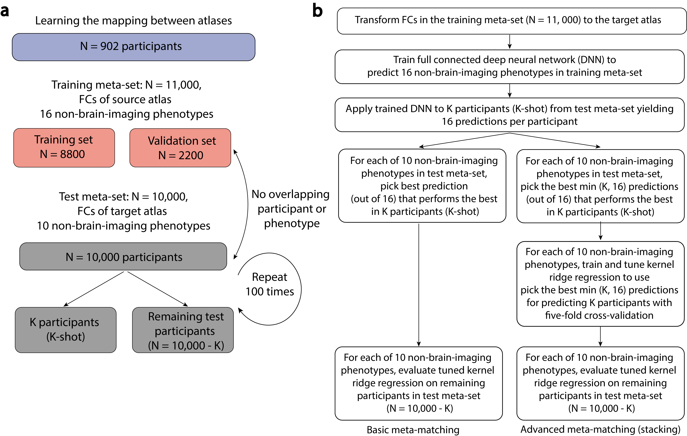

# Meta-Learning across atlases space

## Method

Meta-learning with heterogeneous data. Meta-learning translates predictive models from big datasets to new, unseen phenotypes in independent small datasets of a different atlas. a, The UK biobank dataset (21902 participants) was divided into three datasets. The node timeseries of 902 participants were used to learn the mapping between the atlas of 21 nodes and 55 nodes. The training meta-set comprised 11,000 participants with FCs of source atlas and 16 phenotypes. The testing meta-set comprised 10,000 participants with FCs of target atlas and 10 phenotypes. The test meta-set was randomly split 100 times into K participants (K = 10, 20, 50, 100 and 200) and remaining 10,000 – K participants.  b, Workflow of basic and advanced meta-matching. The data in meta training set is first transformed to the target space. For basic meta-matching, the best performance DNN model on the K participants are used chosen for each new phenotype. For advanced meta-matching (stacking), the prediction of the DNN models are used for trainning a ridge regression model which gives the final prediction.

## Dependencies
- python 
- pytorch
- scikit-learn
- numpy

## Data
The original data are stored in ./data/meta_train.npz, ./data/meta_test.npz. 

## Experiment 
The data in the meta_train should be transformed to the atlas of meta_test before running 
the rest of the code. First create the dataset from the original data:
```
python create_dataset.py
```

### classical: training with ridge regression on small sample 
```
python classical.py
```

### classical_dnn: training with deep neural network on small sample 
You could specify the general parameters of the trainning and hyperparameters of the neural networks
```
python classical_dnn.py --epochs 1000 --weight_decay 8.447320e-04 --lr 3.645653e-03 --dropout 0.241964 \
--scheduler_decrease 312 --n_l1 87 --n_l2 386 --n_l3 313 --n_l4 349 --n_layer 4
```

### Basic meta-matching
```
python ukbb_dnn_mm.py
```

### Advanced meta-matching
```
python ukbb_dnn_mm_stacking.py
```

